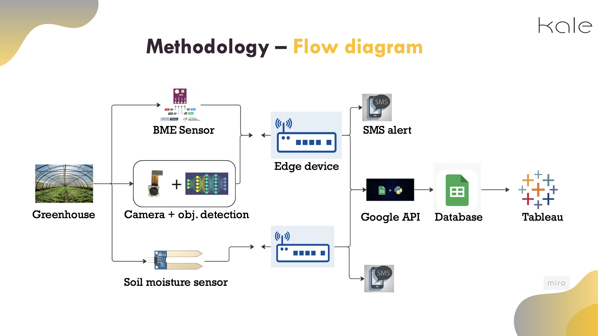
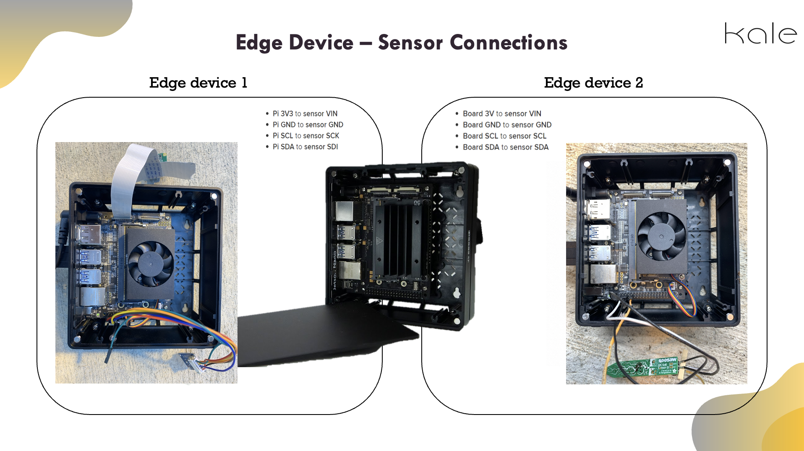
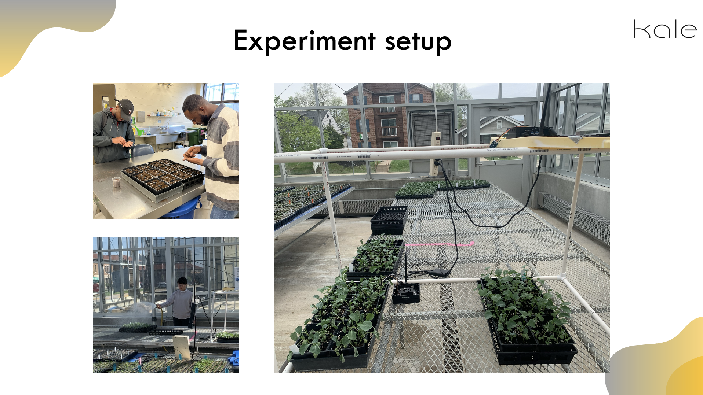
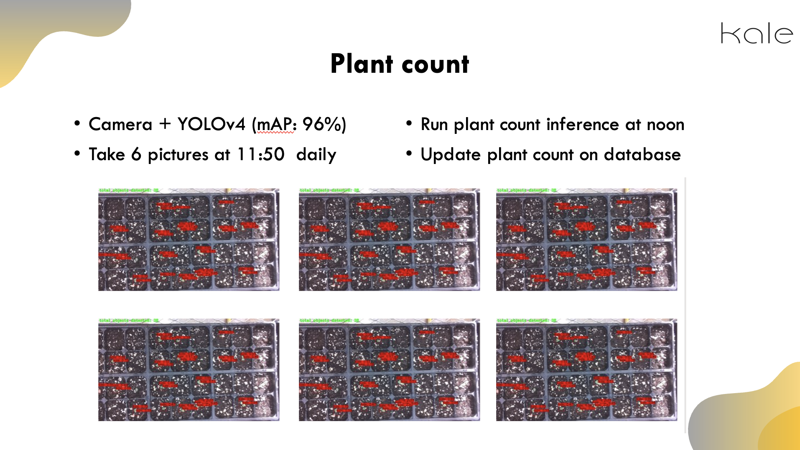
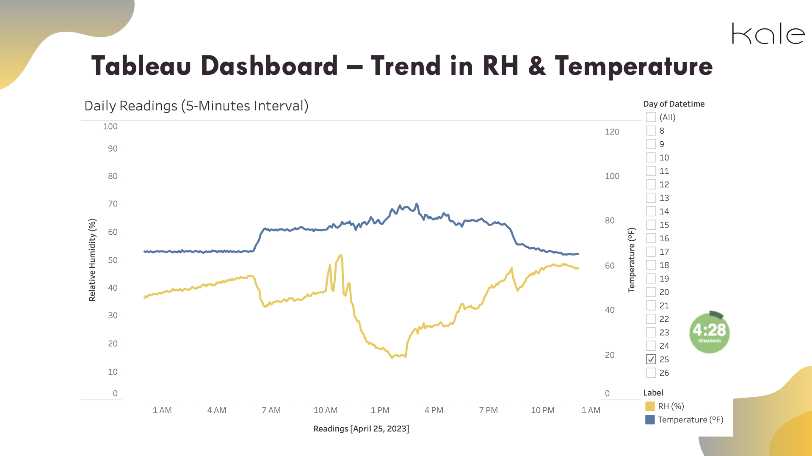
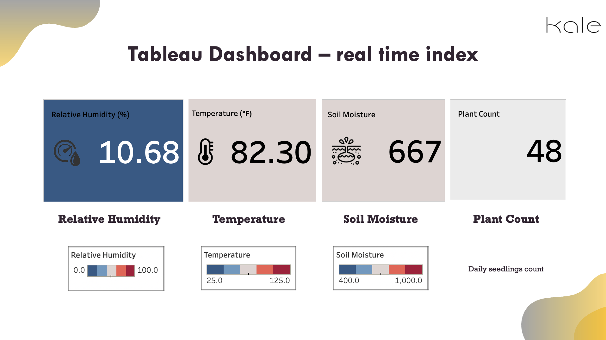

# Edge Device Plant Data Collection & Visualization

## Overview

This project demonstrates how an edge device was utilized to collect plant data, which was then visualized using Tableau to extract meaningful insights. The screenshots included in this repository showcase key visualizations and analysis results from the project presentation.

## Project Workflow

Data Collection: An edge device was deployed to monitor plant conditions, capturing real-time sensor data.

**Methodology**

**Sensor Connection**

**Experiment Setup**

**Object Detection using Yolo V4**

Data Processing: The collected data was cleaned, processed, and formatted for analysis.

Data Visualization: The processed data was imported into Tableau, where various visualizations were created to identify trends and insights.

**Climate Trend**

**Real-Time Dashboard**

Insights & Interpretation: The generated visualizations helped in assessing plant health, environmental conditions, and potential improvements.

## Repository Contents

screenshots/ - Contains key screenshots from the project presentation.

README.md - This document explaining the project.

## Key Visuals

Plant Condition Monitoring

Graphs displaying environmental variables such as temperature, humidity, and CO2 levels.

Trend analysis showcasing variations over time.

## Data Trends & Insights

Correlation between environmental factors and plant health.

Predictive analytics using historical data trends.

## Future Enhancements

Integration with a live dashboard for real-time monitoring.

Deployment of machine learning models for predictive analytics.

Expansion to support multiple edge devices for large-scale analysis.

Acknowledgments

Special thanks to [mention any collaborators, institutions, or sponsors] for their support in this project.
